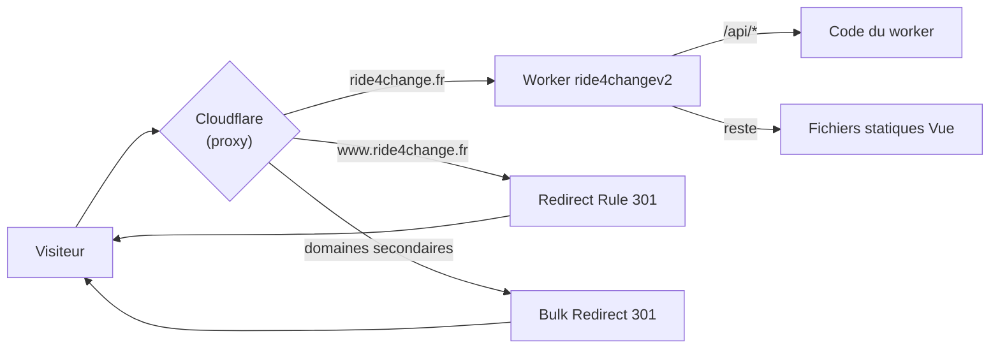

# Ride 4 Change — Configuration DNS et domaines

Mis à jour le 25/09/2026.

## Vue d'ensemble

Le site est servi uniquement sur **https://ride4change.fr**. Les 4 domaines ont été achetés chez OVH, mais leur DNS est géré par Cloudflare. Les autres adresses redirigent en 301 vers le domaine principal.

| Domaine | Rôle | Mécanisme Cloudflare |
| --- | --- | --- |
| `ride4change.fr` | Domaine principal, sert le site | Custom Domain du Worker `ride4changev2` |
| `www.ride4change.fr` | Redirection 301 vers `ride4change.fr` | Redirect Rule de la zone (modèle « Redirect from WWW to Root ») |
| `ride4change.eu` (+ `www`) | Redirection 301 vers `ride4change.fr` | Bulk Redirect du compte |
| `rideforchange.fr` (+ `www`) | Redirection 301 vers `ride4change.fr` | Bulk Redirect du compte |
| `rideforchange.eu` (+ `www`) | Redirection 301 vers `ride4change.fr` | Bulk Redirect du compte |



Toutes les requêtes passent par le proxy Cloudflare. Seul `ride4change.fr` atteint le Worker, et les autres adresses sont redirigées avant.

## Domaine principal : ride4change.fr

La zone est active chez Cloudflare, le Worker `ride4changev2` répond sur `ride4change.fr` et HTTPS fonctionne (note A sur SSL Labs depuis le passage à TLS 1.2 minimum). Le site a été confirmé accessible le 25/09/2026.

1. **Créer la zone** : dans Cloudflare, *Add a domain* → `ride4change.fr` → plan **Free**.
2. **Changer les serveurs DNS chez OVH** : *Domaines → ride4change.fr → Serveurs DNS → Modifier*. Mettre `daisy.ns.cloudflare.com` et `jay.ns.cloudflare.com`, et désactiver DNSSEC avant si besoin.
3. **Attendre l'activation** : la zone passe « Active » (mail de Cloudflare), puis le certificat Universal SSL est émis automatiquement.
4. **Brancher le Worker** : *Workers & Pages → ride4changev2 → Settings → Domains & Routes → Add → Custom Domain* → `ride4change.fr`. Cloudflare crée lui-même l'enregistrement DNS et le certificat. Il ne faut donc créer aucun enregistrement `A`/`AAAA` pour `@` à la main.

Le Custom Domain est configuré dans le dashboard, et non dans `wrangler.toml`, qui ne déclare aucune route. Les déploiements ne le suppriment pas.

## Redirection www.ride4change.fr

`www.ride4change.fr` redirige en 301 vers `ride4change.fr` en conservant le chemin et les paramètres. Fonctionnement confirmé le 25/09/2026.

**1. Enregistrement DNS** (zone `ride4change.fr`, *DNS → Records*) :

| Type | Name | Contenu | Proxy |
| --- | --- | --- | --- |
| AAAA | `www` | `100::` | Proxied (orange) |

`100::` est une adresse fictive : Cloudflare répond lui-même avec la redirection, et rien n'atteint jamais cette adresse. Le proxy est indispensable, sans lui la règle ne s'applique pas.

**2. Règle de redirection** (*Rules → Templates → Redirect from WWW to Root*) :

- Condition : *Wildcard pattern*, Request URL `https://www.*`
- Target URL : `https://${1}`, status **301**, *Preserve query string* coché

Équivalent manuel si le modèle n'est pas disponible : `Hostname equals www.ride4change.fr` → Dynamic `concat("https://ride4change.fr", http.request.uri.path)`, 301, *Preserve query string*.

Au déploiement, Cloudflare affiche « Your DNS configuration may not be proxying traffic for www ». C'est une fausse alerte, car le DNS public répondait bien avec des IP Cloudflare. On a cliqué sur *Ignore and deploy rule anyway*.

## Domaines secondaires

Les zones `ride4change.eu`, `rideforchange.fr` et `rideforchange.eu` sont actives chez Cloudflare. Leurs NS pointaient vers Cloudflare le 25/09/2026.

Pour chacun des trois domaines :

1. **Créer la zone** : *Add a domain* → plan **Free**.
2. **Nettoyer les DNS** importés d'OVH (A, AAAA, CNAME, MX, TXT), puis créer les enregistrements ci-dessous.
3. **Chez OVH** : désactiver DNSSEC s'il est actif, puis *Serveurs DNS → Modifier* → `daisy.ns.cloudflare.com` et `jay.ns.cloudflare.com`. Vérifier la paire exacte sur l'accueil de chaque zone.
4. **Attendre** que la zone soit « Active » (bouton *Check nameservers now* pour accélérer). Tant qu'OVH affiche « en cours d'activation », Cloudflare indique « Invalid nameservers », ce qui est normal.

| Type | Name | Contenu | Proxy | Rôle |
| --- | --- | --- | --- | --- |
| AAAA | `@` | `100::` | Proxied | Fait entrer le trafic dans Cloudflare |
| AAAA | `www` | `100::` | Proxied | Idem pour `www` |
| TXT | `@` | `v=spf1 -all` | — | Déclare qu'aucun serveur n'envoie de mail pour ce domaine |
| TXT | `_dmarc` | `v=DMARC1; p=reject;` | — | Demande de rejeter tout mail usurpant ce domaine |

Chaque domaine inclut chez OVH une offre mail (MX Plan) qui n'a jamais été configurée ni utilisée. Les MX d'OVH ont donc été supprimés. Pour activer un jour une adresse sur l'un de ces domaines, il faudra, dans sa zone Cloudflare : recréer les MX d'OVH (`mx1.mail.ovh.net`, `mx2.mail.ovh.net`, `mx3.mail.ovh.net`), remplacer le SPF par `v=spf1 include:mx.ovh.com -all`, et passer le DMARC à `p=none` le temps de tester.

Aucune Redirect Rule n'est créée dans ces zones : la Bulk Redirect couvre aussi `www`.

Tant qu'une zone n'est pas active, Cloudflare affiche « This hostname is not covered by a certificate » sur les enregistrements. L'avertissement disparaît une fois le certificat émis, environ 15 minutes après l'activation.

## Bulk Redirect

Une seule liste, au niveau du **compte** Cloudflare, redirige les trois domaines secondaires et leurs sous-domaines vers `https://ride4change.fr/`. Fonctionnement confirmé le 25/09/2026.

**Liste** `domaines_secondaires` (*Bulk Redirects → Create Bulk Redirect List*, type Redirect) :

| Source URL | Target URL | Status |
| --- | --- | --- |
| `ride4change.eu/` | `https://ride4change.fr/` | 301 |
| `rideforchange.fr/` | `https://ride4change.fr/` | 301 |
| `rideforchange.eu/` | `https://ride4change.fr/` | 301 |

La source n'a pas de `https://`, pour couvrir http et https. Les paramètres, identiques sur les 3 entrées, sont tous cochés :

- **Preserve query string** : garde `?objet=...`
- **Include subdomains** : couvre `www.`
- **Subpath matching** : redirige toutes les pages, pas seulement l'accueil
- **Preserve path suffix** : garde le chemin demandé

**Règle** `Domaines secondaires vers ride4change.fr` (*Create Bulk Redirect Rule*), qui utilise la liste `domaines_secondaires`, puis *Save and Deploy*. Une liste seule ne fait rien : c'est la règle qui l'active.

Pour ajouter un domaine plus tard : créer sa zone comme dans la section précédente, puis ajouter une entrée à la liste. La règle n'a pas besoin d'être modifiée.

## Lien avec le Worker et le déploiement

Le domaine est rattaché au Worker `ride4changev2` par le Custom Domain. Le code n'a pas eu besoin d'être modifié pour le domaine.

| Élément | Valeur | Effet |
| --- | --- | --- |
| `wrangler.toml` → `name` | `ride4changev2` | Nom du Worker sur lequel le Custom Domain est branché |
| `wrangler.toml` → `[assets] run_worker_first` | `["/api/*"]` | Seules les URLs `/api/*` exécutent le code du worker, le reste est servi en statique |
| `wrangler.toml` → routes | aucune | Le domaine est géré dans le dashboard, pas par le code |
| `vite.config.ts` → `base` | `/` quand `WORKERS_CI` est défini | Le site est servi à la racine de `ride4change.fr` |
| Router Vue | `createWebHashHistory` | Les URLs sont en `/#/...` : aucune réécriture côté serveur, et les redirections 301 conservent le `#` |

**Déploiement** : chaque push sur `main` déclenche dans Cloudflare `pnpm build` puis `npx wrangler deploy`. Le Custom Domain reste en place d'un déploiement à l'autre. Les variables `VITE_SUPABASE_URL` et `VITE_SUPABASE_PUBLISHABLE_KEY` sont des *build variables* du Worker.

**Option** : déclarer le domaine dans le code pour le versionner, en ajoutant à `wrangler.toml` :

```toml
routes = [{ pattern = "ride4change.fr", custom_domain = true }]
```

## Vérifications et points restants

Les 8 adresses doivent toutes arriver sur `https://ride4change.fr/`, avec le cadenas : `ride4change.fr` et les 7 autres (`www.ride4change.fr`, `ride4change.eu`, `rideforchange.fr` et `rideforchange.eu`, avec ou sans `www`).

**Pour tester :**

- Utiliser un téléphone en 4G ou un autre PC. Le réseau de l'entreprise LeGouessant bloque le domaine (erreur 403).
- Après un changement de NS, un poste peut garder en cache l'ancienne réponse d'OVH : essayer en navigation privée ou sur un autre appareil.
- Pour vérifier le DNS : `Resolve-DnsName <domaine> -Server 1.1.1.1`. Les IP Cloudflare (`188.114.x`, `104.21.x`, `172.67.x`, `2606:4700:…`, `2a06:98c1:…`) indiquent un enregistrement proxifié.

**Points restants :**

- [x] *SSL/TLS → Edge Certificates → Minimum TLS Version* passé à **1.2** sur `ride4change.fr` le 25/09/2026. SSL Labs donne la note **A** sur les 4 IP, avec TLS 1.2 et 1.3 uniquement.
- [ ] Envoi des messages de `/api/contact`, par exemple par Resend depuis `contact@ride4change.fr`. Il faudra alors ajouter les enregistrements SPF, DKIM et DMARC de Resend dans la zone `ride4change.fr`.
